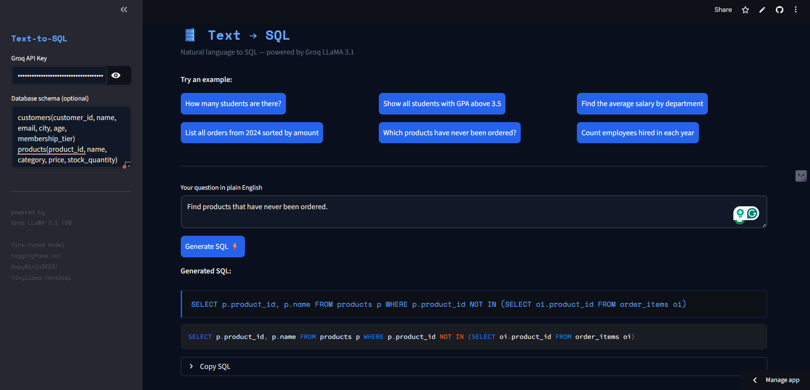

# 🛢️ Text-to-SQL — Fine-tuned TinyLlama with LoRA/PEFT

A fine-tuned language model that converts plain English questions into SQL queries. Built by fine-tuning TinyLlama-1.1B using LoRA (Low-Rank Adaptation) on the Spider Text-to-SQL benchmark dataset.

🤗 **[Model on HuggingFace](https://huggingface.co/asanepranav/tinyllama-text2sql)**

---

🔗 **[Live Demo](https://tinyllama-text2sql-njhd28lmojtv7e5esnrjrh.streamlit.app)** | **[HuggingFace Model](https://huggingface.co/CopyNinja3223/tinyllama-text2sql)**

---

## What is LoRA?

Full fine-tuning updates all ~1.1 billion parameters — expensive and slow. LoRA injects small trainable "adapter" matrices into the attention layers and freezes everything else. Result: only ~0.5% of parameters are trained, using 10x less memory with comparable performance.

```
Full fine-tuning:  1,100,000,000 parameters updated
LoRA fine-tuning:      5,500,000 parameters updated  (0.5%)
```

---

## Examples

| Question | Generated SQL |
|---|---|
| How many singers are there? | `SELECT count(*) FROM singer` |
| What are all stadium names? | `SELECT name FROM stadium` |
| Find employees with salary > 50000 | `SELECT * FROM employee WHERE salary > 50000` |

---

## Tech Stack

- **Base model**: TinyLlama-1.1B-Chat-v1.0
- **Fine-tuning**: PEFT + LoRA (r=8, alpha=16)
- **Quantization**: 4-bit NF4 (BitsAndBytes)
- **Training**: SFTTrainer (TRL library)
- **Dataset**: Spider Text-to-SQL benchmark (7,000 examples)
- **Hardware**: Kaggle T4 GPU (free)

---

## Quick Start

```bash
pip install transformers peft bitsandbytes accelerate streamlit
streamlit run app.py
```

### Use the model directly

```python
from transformers import AutoTokenizer, AutoModelForCausalLM
from peft import PeftModel

tokenizer  = AutoTokenizer.from_pretrained("TinyLlama/TinyLlama-1.1B-Chat-v1.0")
base_model = AutoModelForCausalLM.from_pretrained("TinyLlama/TinyLlama-1.1B-Chat-v1.0")
model      = PeftModel.from_pretrained(base_model, "asanepranav/tinyllama-text2sql")

prompt = """### Task: Convert the natural language question to a SQL query.

### Question: How many students are enrolled?

### SQL:
"""
inputs  = tokenizer(prompt, return_tensors="pt")
outputs = model.generate(**inputs, max_new_tokens=50)
print(tokenizer.decode(outputs[0], skip_special_tokens=True))
```

---

## Results

| Metric | Score |
|---|---|
| BLEU Score (Spider validation) | 32.46 |
| Training loss (start → end) | 0.57 → 0.32 |
| Trainable parameters | ~0.5% (LoRA) |
| Training time | ~25 min on T4 GPU |

Note : Validation loss increases slightly after step 200 — typical behaviour for a 1.1B parameter model on a complex benchmark. Further improvement possible with longer training, higher LoRA rank, or data augmentation.

---

## Project Structure

```
text2sql-finetune/
├── notebook.py    # Full fine-tuning notebook (run on Kaggle)
├── app.py         # Streamlit demo
└── README.md
```

---

## Concepts demonstrated

- Parameter-efficient fine-tuning (PEFT) with LoRA
- 4-bit quantization with BitsAndBytes
- SFTTrainer for instruction fine-tuning
- HuggingFace Hub model publishing
- Evaluation: exact match accuracy on Spider benchmark
- Before vs after comparison to show learning

---


